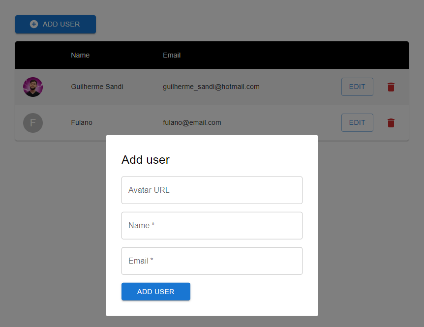

<h1 align="center">Crud com Material UI e Redux</h1>

<div align="center">

[](https://www.linkedin.com/in/guilhermesandi/)

<p align="center">
    
</p>

</div>

<br>

## 🪧 Sobre

Esse é um repositório contém um CRUD simples utilizando todas as tecnologias listadas abaixo. :)

## ✨ Tecnologias

-   [ ] React
-   [ ] Typescript
-   [ ] Styled Components
-   [ ] Redux Toolkit
-   [ ] Material UI
-   [ ] React Hook Form
-   [ ] Yup

## 🚀 Como usar

```
1- Clone esse repositório

2- Vá no diretório raiz do repositório

3- Instale as dependências:
$ yarn install

4- Inicie a aplicação:
$ yarn start
```